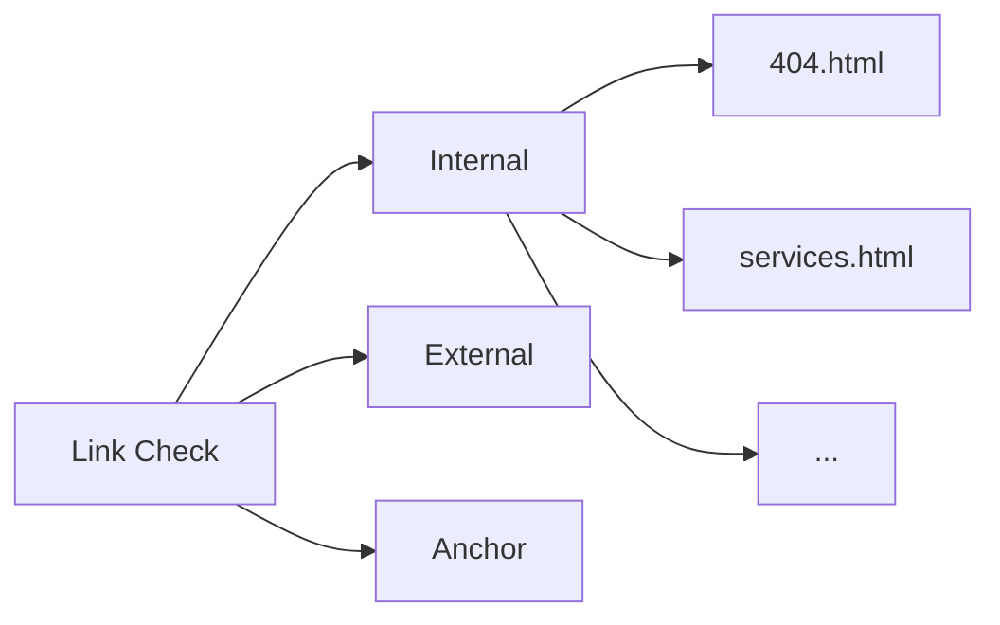
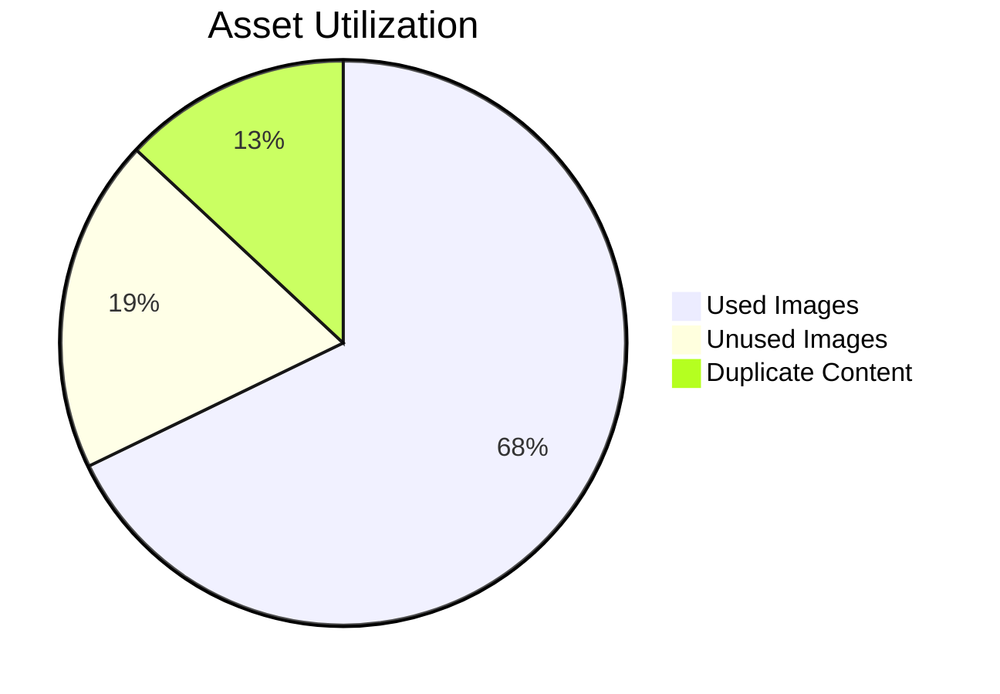
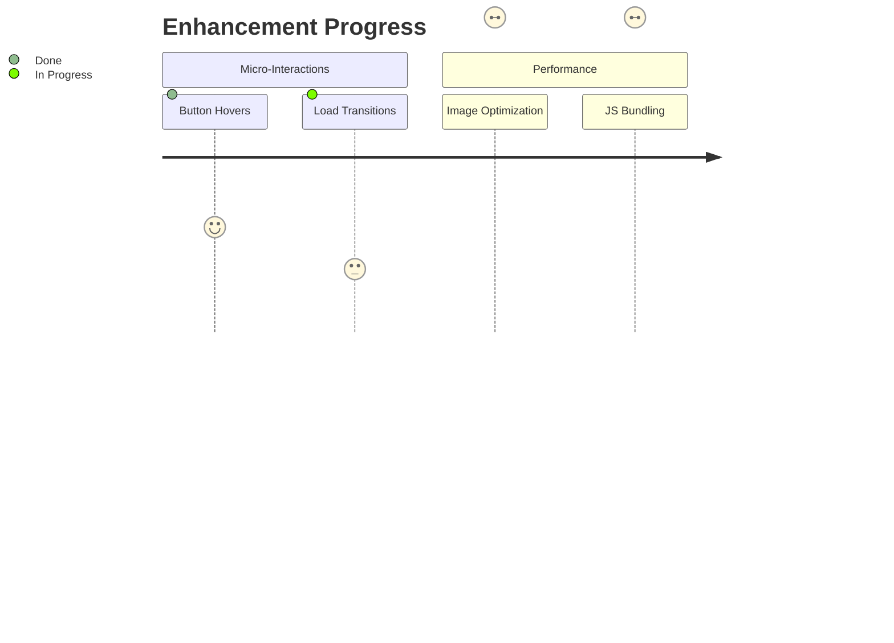

# Premium Audit Report

## Phase 1: Link Validation

## Phase 2: Redundancy Audit

## Phase 3: Enhancements

[Full technical report pending...]
Need to install the following packages:
linkinator@6.1.2
Ok to proceed? (y) [200] public
[200] public/assets/images/logos/Color%20logo%20-%20no%20background.png
[200] public/about.html
[200] public/CustomSoftwareDevelopment.html
[200] public/MobileDevelopment.html
[200] public/WebDevelopment.html
[200] public/DataAnalysis.html
[200] public/EcommerceSolutions.html
[200] public/ArtificialIntelligence.html
[200] public/DigitalInnovation.html
[200] public/VirtualReality.html
[200] public/GameDevelopment.html
[200] public/CloudComputing.html
[200] public/CyberSecurity.html
[200] public/ProductManagement.html
[200] public/resources.html
[200] public/contact.html
[200] public/blog.html
[200] public/services.html
[200] public/assets/images/hand-touching.webp
[200] public/assets/images/ai-blog.webp
[200] public/assets/images/futuristic-smart-city.webp
[200] https://cdnjs.cloudflare.com/ajax/libs/tailwindcss/2.2.19/tailwind.min.css
[200] public/assets/images/saas-concept2.webp
[200] public/assets/images/cloud-blog.webp
[200] public/assets/media/0_Globalization_Technology_3840x2160.webm
  [200] public
  [200] public/assets/images/logos/Color%20logo%20-%20no%20background.png
  [200] public/about.html
  [200] public/CustomSoftwareDevelopment.html
  [200] public/MobileDevelopment.html
  [200] public/WebDevelopment.html
  [200] public/DataAnalysis.html
  [200] public/EcommerceSolutions.html
  [200] public/ArtificialIntelligence.html
  [200] public/DigitalInnovation.html
  [200] public/VirtualReality.html
  [200] public/GameDevelopment.html
  [200] public/CloudComputing.html
  [200] public/CyberSecurity.html
  [200] public/ProductManagement.html
  [200] public/resources.html
  [200] public/contact.html
  [200] public/blog.html
  [200] public/services.html
  [200] public/assets/images/hand-touching.webp
  [200] public/assets/images/ai-blog.webp
  [200] public/assets/images/futuristic-smart-city.webp
  [200] https://cdnjs.cloudflare.com/ajax/libs/tailwindcss/2.2.19/tailwind.min.css
  [200] public/assets/images/saas-concept2.webp
  [200] public/assets/images/cloud-blog.webp
  [200] public/assets/media/0_Globalization_Technology_3840x2160.webm
