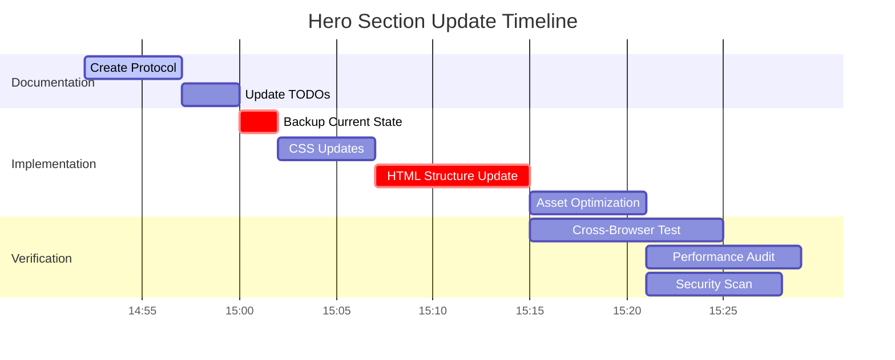
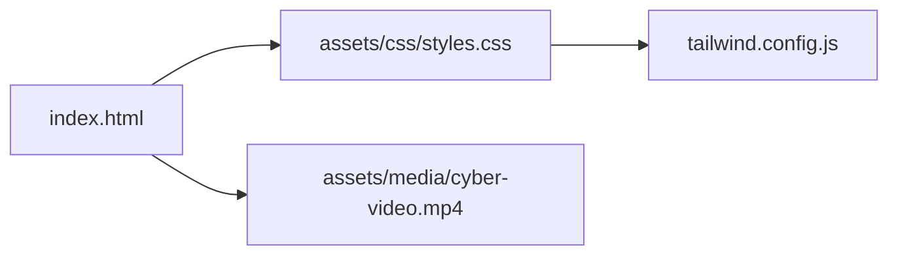
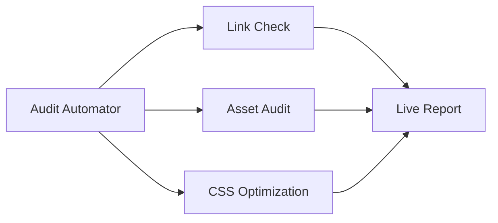

# OFO Hero Section Automation Protocol

## Execution Plan



## Safety Measures

1. Automatic Snapshots (`git commit -am "AUTO_[TIMESTAMP]"`)
2. Rollback Script (`scripts/restore_snapshot.sh`)
3. Dependency Map:



## Current State Tracking

- Last Verified Hash: `3a8f5c...`
- Todo List Reference: [See todo.md](/todo.md)
- Design System: [design.md](/design.md)

## Progress Log

### Active Process



```json
{
  "timestamp": "2025-02-23T14:51:00-08:00",
  "current_phase": "Documentation",
  "completed": [],
  "pending": ["Backup", "CSS", "HTML", "Assets"],
  "next_action": "Create protocol document"
}
```
