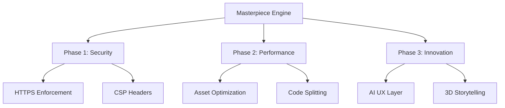
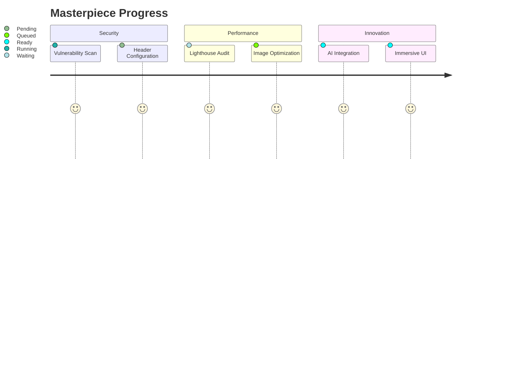

# OFO Masterpiece Architecture

## Core Implementation Plan



## Live Progress Tracker



## Safety Protocols

```json
{
  "autoCommitInterval": 900,
  "healthChecks": [
    "security-headers",
    "lighthouse-score",
    "dependency-integrity"
  ],
  "rollbackTriggers": [
    "test-failure",
    "vulnerability-detected",
    "performance-regression"
  ]
}
```
